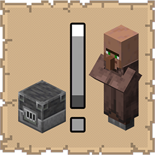

# Dibs!

  

   
A lightweight mod that lets you permanently bind villagers to workstation blocks, preventing other villagers from claiming them.

## Functionality

  

  
When you hold a stack of workstation items (e.g. a composter, lectern, or blast furnace) and right-click an unemployed villager, a short binding ritual begins. The villager is bound to that item. When you then place the workstation block, it is permanently reserved for that villager. No other villager can claim it, walk toward it, or gain a profession from it.

Key behaviors:
- Bound workstations are exclusively claimed by their assigned villager
- Other villagers are blocked from claiming or gaining a profession from a bound block
- Breaking the workstation automatically removes the binding
- The correct villager is guided to their workstation and gains their profession normally
- Press **V** while looking at a bound workstation to make its villager glow so you can find them
- Bindings persist through server restarts, chunk unloads, and world reloads

## Benefits

  

   
In vanilla Minecraft, villager workstation assignment is entirely random. Any unemployed villager can steal any unclaimed workstation, making it frustrating to set up organized trading halls or dedicated profession setups. Dibs! solves this completely by letting you choose exactly which villager gets which workstation. No more accidental profession swaps, no more fighting over blocks.

- **Deterministic profession assignment**: You decide who gets what, every time
- **Protected workstations**: Other villagers cannot gain a profession from a bound workstation or show any claiming behavior. They may still briefly approach it, but will be silently evicted with no visible effects.
- **Works with any workstation**: Supports all vanilla job site blocks
- **Persistent**: Bindings survive restarts and chunk unloads
- **Multiplayer friendly**: Bindings are per-world and shared across all players on the server

## Installation

  

   
### Prerequisites
* **Minecraft:** 1.21.10
* **Loader:** [Fabric Loader](https://fabricmc.net/use/installer/) (>=0.18.4)
* **Core Dependencies:**
    * [Fabric API](https://modrinth.com/mod/fabric-api)
    * [Cloth Config API](https://modrinth.com/mod/cloth-config) (Required for configuration)
    * [Mod Menu](https://modrinth.com/mod/modmenu) (Recommended for configuration)

### Steps
1. Download the latest `.jar` from [Modrinth](https://modrinth.com/mod/dibs!) or [CurseForge](https://www.curseforge.com/minecraft/mc-mods/dibs).
2. Move the file into your Minecraft `%appdata%/.minecraft/mods` folder.
3. Launch the game using the Fabric profile.

## Support

  

   
If you encounter bugs or wish to contribute:
* [Report any problems you find.](https://github.com/armaninyow/Dibs/discussions/categories/issues)
* [Share your ideas for new features.](https://github.com/armaninyow/Dibs/discussions/categories/suggestions)

## Credits

  

   
* **Author**: Armaninyow
* **License**: Released under [CC0-1.0](https://creativecommons.org/publicdomain/zero/1.0/).

