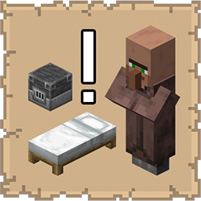

# Dibs!

## Installation

* [Modrinth](https://modrinth.com/mod/dibs!)
* [CurseForge](https://www.curseforge.com/minecraft/mc-mods/dibs)

## Support
   
If you encounter bugs or wish to contribute:
* [Report any problems you find.](https://github.com/armaninyow/Dibs/discussions/categories/issues)
* [Share your ideas for new features.](https://github.com/armaninyow/Dibs/discussions/categories/suggestions)

## Changelog

  

   
### 3.1.1—1.21.x
* Fixed a crash that occurred when ticking villagers on 1.21.10
### 3.1.0—1.21.x
* Added support for binding already-traded, employed villagers to their matching workstation block
* Added the ability to press V while looking at a bound villager to draw a trail of white particles from the villager to their bound workstation and/or bed
* Split 1.21.5-1.21.11 into two separate version ranges to account for API differences between versions
* Merged 1.21-1.21.4 into a single version range due to shared API compatibility
* Fixed a crash on 1.21.2-1.21.3 caused by a packet codec API that was not available until 1.21.4
* Fixed a crash on 1.21.5–1.21.8 caused by a keybinding API that was not available until 1.21.9
### 3.0.0—1.21.x
* Added multi-version support covering Minecraft 1.21 through 1.21.11
### 2.0.0—1.21.11
* Updated to Minecraft 1.21.11
### 1.1.0—1.21.10
* Added villager-to-bed binding system allowing players to reserve a bed for any villager by right-clicking it with a bed item in hand
* Added tagged item lore showing Bound to: <Profession> #<UUID> on bed items after binding
* Added Locate Owner support for beds. Pressing V while looking at either half of a bound bed applies a Glowing effect to the bound villager
* Prevented unbound villagers from walking toward or claiming workstation blocks and beds already reserved for another villager by filtering bound positions out of POI scans before any brain task sees them
* Fixed bindings not persisting across world saves and reloads by replacing the broken Codec.unit stub with a proper RecordCodecBuilder-based codec
* Cleared bed bindings automatically when either half of the bound bed is broken
* Steered bound villagers toward their reserved bed every 20 ticks if they have lost the memory of it
### 1.0.0—1.21.10
* Initial Release

